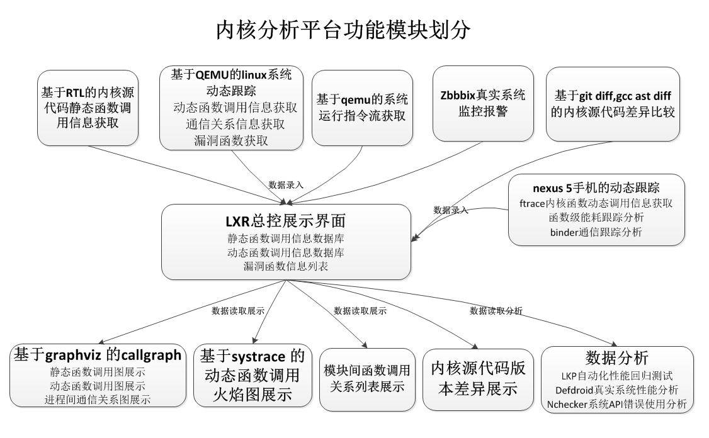

# 内核分析平台部署帮助文档

本文档描述整个内核分析平台的部署过程中所涉及的各功能部分的部署工作，各部分的具体描述有分别的文档链接。

内核分析平台由函数调用图、QEMU模拟系统动态跟踪、Nexus 5真实系统动态跟踪、源码差异分析等四个部分组成，需要部署5台Linux虚拟机系统，并在虚拟机中部署相关软件。下面是部署详细过程描述。
## 1 函数调用图
由一台虚拟机组成，同时它也负责整个内核分析平台的集成工作。

 1. [函数调用图部署](https://github.com/xyongcn/db-rtl-callgraph/blob/master/README.txt)
 2. [用户测试数据上传服务](https://github.com/xyongcn/qemu-instru-tracer/blob/master/sikulitest/README.md)

## 2 QEMU模拟系统动态跟踪
两台虚拟机分别完成模拟环境下的函数调用跟踪和指令频度分析工作，它们的输出信息会在处理后保存到“函数调用图”虚拟机上。

 1. [基于QEMU的内核函数调用服务](https://github.com/xyongcn/qemu-tracer/blob/master/README.md)
 1. [systrace分析服务]
 1. [CPU指令频度分析服务](https://github.com/xyongcn/qemu-instru-tracer)：[系统安装帮助](https://github.com/xyongcn/qemu-instru-tracer/blob/master/deploy_help_doc/%E6%8C%87%E4%BB%A4%E9%A2%91%E5%BA%A6%E7%BB%9F%E8%AE%A1%E4%BD%BF%E7%94%A8%E5%92%8C%E5%B8%AE%E5%8A%A9%E6%96%87%E6%A1%A3.txt)、[sikuli安装](https://github.com/xyongcn/qemu-instru-tracer/blob/master/sikulitest/README.md)

## 3 Nexus 5真实系统动态跟踪
一台连有Nexus 5 手机的虚拟机负责能耗分析和binder通信跟踪工作。

 1. [Nexus5上Android的ftrace自动跟踪分析服务](https://github.com/xyongcn/cg-ftracer/blob/master/README.md)
 1. [函数级能耗跟踪和分析服务](https://github.com/xidian-hgj/FunPower/blob/master/README.md)
 1. [binder通信跟踪和分析服务](https://github.com/xyongcn/Binder/blob/master/Nexus5/README.md)

## 4 源码差异分析
源码差异分析功能中的一部分放在“函数调用图”虚拟机上，另一部分放在“函数调用接口差异分析”虚拟机上。

 1. [代码差异分析服务](https://github.com/xyongcn/call-graph-diff/blob/master/README.md)

 1. [函数调用接口差异分析服务](https://github.com/mikewangexe/linux_api_diff/blob/master/README.md)

## 5 功能模块划分

